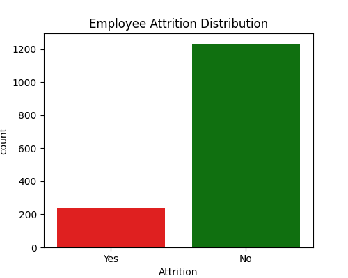
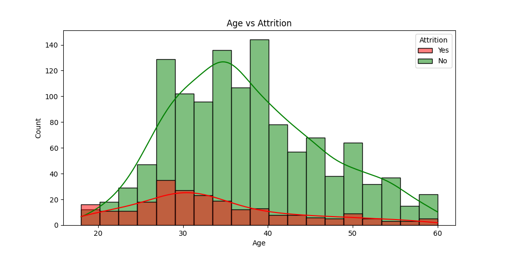
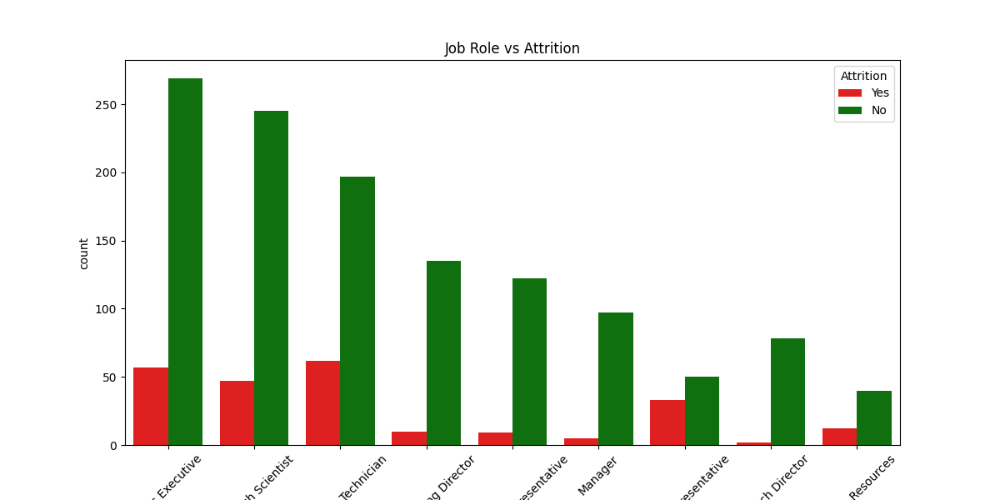
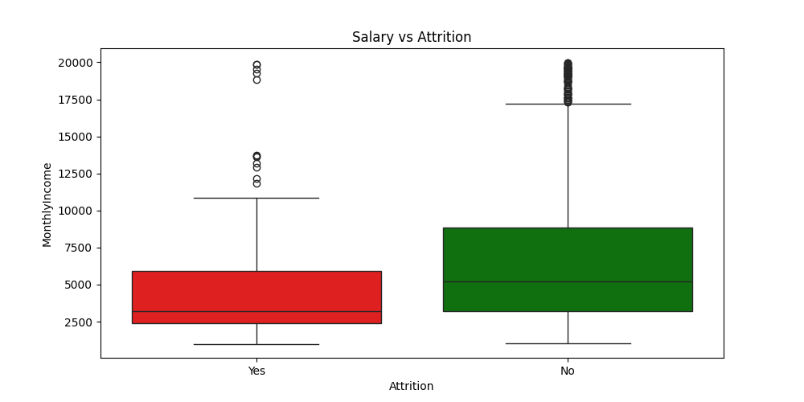
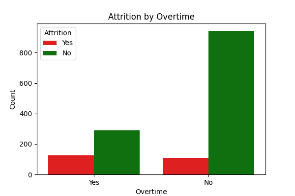
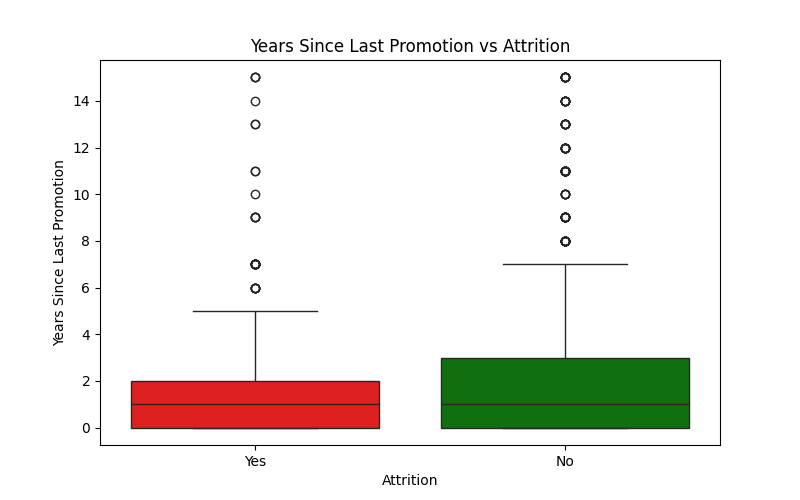

# 📊 HR Attrition Analysis

### 🚀 **Project Overview**
Employee attrition is a critical issue for businesses. This project analyzes HR data to **identify key factors that contribute to employee turnover** and provides **actionable insights** to reduce attrition.

### 📂 **Dataset**
- **Source:** [IBM HR Analytics Employee Attrition Dataset](https://www.kaggle.com/datasets/pavansubhasht/ibm-hr-analytics-attrition-dataset?resource=download)
- **Size:** 1,470 employees, 35 features
- **Target Variable:** `Attrition` (Yes/No)

---

## 📊 **Key Insights from the Analysis**
✔ Younger employees (20-30) leave more frequently  
✔ Sales Representatives & Lab Technicians have the highest attrition  
✔ Employees with **low salaries** & **high overtime** leave more  
✔ **Lack of career growth & promotions** increases attrition risk  
✔ Poor **work-life balance** contributes to employee turnover  

---

## 🔍 **Visualizations**
### 📌 Attrition Distribution  
[](plots/attrition_distribution.png)

### 📌 Age vs Attrition  
[](plots/age_vs_attrition.png)

### 📌 Job Role vs Attrition  
[](plots/jobrole_vs_attrition.png)

### 📌 Salary vs Attrition  
[](plots/salary_vs_attrition.png)

### 📌 Overtime vs Attrition  
[](plots/overtime_vs_attrition.png)

### 📌 Promotion & Career Growth vs Attrition  
[](plots/promotion_vs_attrition.png)

---

## 📌 **Technologies Used**
- **Python** (Pandas, Seaborn, Matplotlib)
- **Jupyter Notebook / PyCharm**
- **Git & GitHub for Version Control**

---

## 📢 **HR Recommendations**
✅ **Improve work-life balance** (flexible work, remote options)  
✅ **Increase salaries** for high-risk job roles  
✅ **Reduce excessive overtime** to prevent burnout  
✅ **Create clear career growth & promotion plans**  

---

## 💻 **How to Run the Project**
1️⃣ Clone the repository:
   ```sh
   git clone https://github.com/charankumar-g/-HR-Attrition-Analysis.git

2️⃣ Install required Python libraries:

pip install pandas seaborn matplotlib

3️⃣ Run the script:

    If using Jupyter Notebook:

jupyter notebook attrition_analysis.ipynb

If using Python script:

    python attrition_analysis.py

4️⃣ View saved plots inside the plots/ folder.

📌 Contact
💼 Author: Charan Kumar G
📩 Email: charankumar.career@gmail.com
🔗 LinkedIn: https://www.linkedin.com/in/charankumar-g

⭐ If you found this project useful, please give it a star! ⭐
